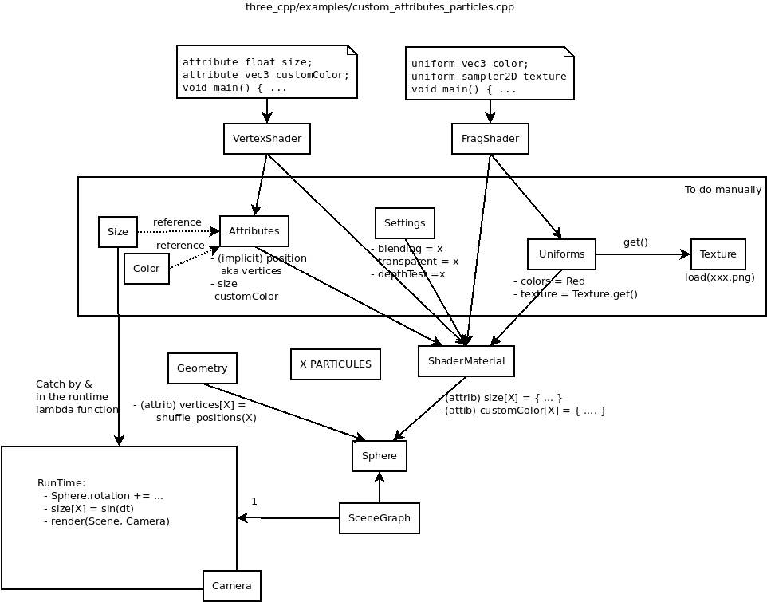

# Study

Let's study the example [custom_attributes_particles.cpp](https://github.com/jdduke/three_cpp/blob/master/examples/custom_attributes_particles.cpp) from the repo [three_cpp](https://github.com/jdduke/three_cpp) which is a portage of
the [three.js](https://github.com/mrdoob/three.js) in C++.

This is just a thinking about what I like and what I dislike in both libs (three_cpp and mine) and how to improve my lib.

The diagram of instance of the code is given as [Dia file](custom_attributes_particles.dia)



The developper has to manually the following steps:
- Define manally all attributes and uniforms variable from the GLSL code

```
vertexShader = "attribute float size;
                attribute vec3 customColor;
                void main() { ...";

Uniforms uniforms;
uniforms["color"] = Uniform(THREE::c, Color(0xffffff));

Attributes attributes;
attributes["size"] = Attribute(THREE::f);
```

before to pass them into ShaderMaterial constructor:
```
ShaderMaterial::create(vertexShader, fragmentShader, uniforms, attributes, ...);
```

Our GLProgram class creates list Uniforms and Attributes it automatically.

- Create geometry and materials:

```
#define X particles
geometry = Geometry::create();
geometry->vertices = { shuffling X positions };
sphere = ParticleSystem::create(geometry, shaderMaterial);

// To be used inside the lambda function gameLoop()
Uniform& sizes = shaderMaterial->attributes["size"];
Uniform& colors = shaderMaterial->attributes["customColor"];

// Init X elements (std::vector<float>) typed of Any.
std::vector<float> values_size = { ... };
std::vector<Color> values_color = { ... };
size.value = values_size;
color.value = values_color;

// Use sizes, colors (they now act as global variables)
anim::gameLoop([&](float dt) -> bool
{
    for (i = 0; i < X; ++i)
    {
       sizes[i] = ...
    }
    size.needsUpdate = true;
    render(*scene, *camera);
}
```

Drawbacks are:
- `sizes` and `colors` are captured by the lambda function. They act as global variables.
- Usage of `Any`. Shall we have to use temporary vector such as `values_size` ?
- Dirty data shall be set manually `size.needsUpdate = true;`.

## Current pro/drawbacks of my lib

- GLProgram is replacing shaderMaterial: list of Uniform and list of Attributes are created
  automatically.
- Dirty Attributes and Uniforms are automatically flushed into the GPU.
- In three_cpp all are done explictely (kind of state machine) in `render` making it hard to
  understand its code.
- My major drawback is GLProgram, GLVAO, GLVBO shall be dispatched between Geometry (VBO),
  material properties (uniform => GLProgram; attributes => VBO) and VAO do not shared VBOs so
  if we create X spheres we have X * N VBOs stored on CPU.
